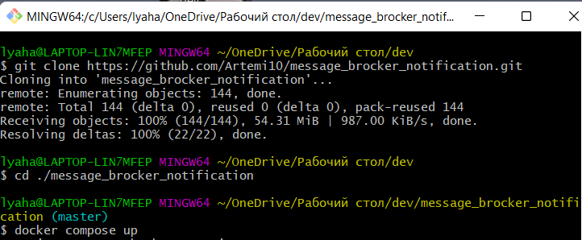

# Devanmejia Message-broker application
>Simple message broker project

## Table of Contents
* [General Info](#general-info)
* [Technologies Used](#technologies-used)
* [Features](#features)
* [Deployment](#deployment)
* [Execution](#execution)
* [Contact](#contact)

## General Info
- Application with microservice architecture which allows user to send them log in or sign up notifications. 

## Technologies Used
- Java 17
- Spring Boot:
    * Spring CLoud
    * Spring Web
    * RabbitMQ
- Lombok
- MongoDB
- Docker
- Docker compose

## Features
- Application allows user to log in and sign up into system.
- Application will send notification email when user sign up or log in.
- Users can easily generate stats which consist of amount of notification amount by email.

## Deployment
- Download git project
> git clone https://github.com/Artemi10/message_brocker_notification.git
- Enter to project directory
> cd ./message_brocker_notification
- Start docker engine
- Run docker-compose command
> docker-compose up

## Execution
- http://localhost:8080/api/v1/auth/sign-up - Sign Up User
- http://localhost:8080/api/v1/auth/log-in - Log in User
- http://localhost:8080/api/v1/stats - Get all stats
- http://localhost:8080/api/v1/stats/email/${email} - Get stats by email

## Contact
- Vk: https://vk.com/devanmejia
- Email: lyah.artem10@mail.ru
